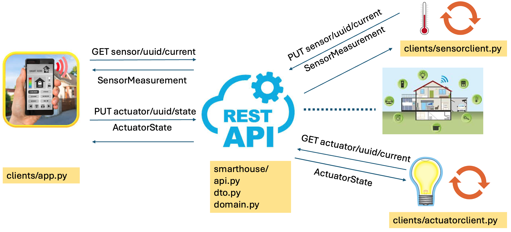

## ING301 Prosjekt - Del C

I del C av prosjektet skal dere implementere en nettverksapplikasjon bestående av fire deler:

- Et REST API for en smarthus sky-tjeneste ved bruk av rammeverket [FastAPI](https://fastapi.tiangolo.com)
- En klient-applikasjon som representerer en temperatursensor som rapporterer målinger til sky-tjenesten
- En klient-applikasjon som representerer en lyspære som endrer tilstand (av/på) basert tilstand satt i sky-tjenesten
- En klient-applikasjon som gjør det mulig å hente målinger fra temperatursensoreren og sette tilstanden på lyspæren baser via sky-tjenesten.

Samlet betyr det at en en bruker via sky-tjenesten kan få informasjon om temperaturen i huset og kan kontrollere lyspæren. 

Klient-applikasjonen skal basere seg på [requests-biblioteket](https://pypi.org/project/requests/) for å implementere bruk av REST API'et.

Figuren nedenfor viser illustrerer den nettverksapplikasjon som dere skal ende opp med.




### Oppgave 1: Hente start-koden

Start-koden for prosjektet er organisert på tilsvarende måte som de tidligere deler av prosjektet og inneholder løsningsforslaget fra del A. 

```
.
├── README.md    
├── clients
   ├── __init__.py
│  ├── actuatorclient.py  <-- nytt: her skal lyspære-klienten implementeres
│  ├── app.py             <-- nytt: her skal bruker-klienten implementeres
   ├── common.py          <-- nytt: her er klasse for utveksling a målinger/tilstander implementert
│  └── sensorclient.py    <-- nytt: her skal temperaturmåler-klienten implementeres        
├── smarthouse
│  ├── __init__.py
│  ├── api.py           <-- nytt: her skal REST API (sky-tjenesten) for smarthuset implementeres
│  ├── domain.py
│  └── dto.py           <-- nytt: klasser for dataoverføring mellom klienter og sky-tjenesten
├── tests
│  ├── __init__.py
│  ├── bruno            <-- nytt: Bruno samling av forespørseler for testing av REST API
│  │  └── ...
│  ├── demo_house.py
│  └── test_part_a.py
└── www                 <-- nytt: en liten webside for å teste REST API'et
   └── ...
```

For å forenkle del C av prosjektet skal vi ikke bruke koden for persistens i database fra del B. De som ønsker kan kopiere egen løsning fra del A og eventuelt også integrere database-delen.

Start med å klone dette start-kode repository på samme måten som tidligere ved å bruke "Use as Template" funksjonaliteten på GitHub og så klone ned til din lokale maskin.

### Oppgave 2: Etablere virtuelt Python utviklingsmiljø 

> [VIKTIGT]
> Dette prosjektet forutsetter at du bruker Python versjon **3.12** eller nyere.
> Hvis `python -V` viser et tall lavere enn `3.12.0` så må du [først installere](https://wiki.python.org/moin/BeginnersGuide/Download)
> den nyeste Python versjonen og [legger den på din `PATH`](https://docs.python.org/3/using/windows.html#excursus-setting-environment-variables).

For implementasjon av nettverksapplikasjonen skal vi bruke HTTP-protokollen for kommunikasjon mellom klient-applikasjonene og sky-tjenesten og bygge på to biblioteketer:

- [FastAPI](https://fastapi.tiangolo.com) for å implementere REST API for sky-tjenesten (server-siden)
- [Requests](https://pypi.org/project/requests/) for å implementere REST API klienter (klient-siden)

Ingen av disse modulene/pakkene er del Python sin standard bibliotek og må derfor installeres som [Python Packages](https://packaging.python.org/en/latest/overview/).
Installasjon av packages kan være en utfordring siden en må manøvrere ting som [Externally Managed Environments](https://packaging.python.org/en/latest/specifications/externally-managed-environments/#externally-managed-environments) og package managers som [`pip`](), [`conda`](), [`poetry`](). Dette kan være utfordrende i starten!

Det er god praksis å lage et [virtual environment](https://packaging.python.org/en/latest/guides/installing-using-pip-and-virtual-environments/#creating-a-virtual-environment) for hvert Python prosjekt.  Dette gjør at en kan styre hvilken Python-fortolker som skal brukes og holde installerte pakker adskilt mellom ulike prosjekt.

For de som bruker PyCharm eller VSCode kan et virtuelt Python miljø etableres via grensesnittet når et prosjekt for koden opprettes. 

Alternativt kan et virtual environment opprettes ved å åpne et nytt terminalvindu og så bevege seg inn i prosjektmappen.

Her utfører du følgende kommando:
```bat
python -m venv .venv
```
hvis du bruker Windows, eller
```bash
python3 -m venv .venv
```
hvis du bruker Linux/UNIX/MacOS.

Hvis du får en melding som `module 'venv' not found` så må du installere den først i din system interpreter med:
```bat 
python -m pip install venv
```
Vær obs på at under noen operativsystemer/installasjoner der 
[Python fortolkeren forvaltes av operativsystemet eller tilsvarende pakkeforvaltning](https://packaging.python.org/en/latest/specifications/externally-managed-environments/#externally-managed-environments),
så må `venv`-modulen installeres gjennom operativsystemets pakkeforvaltning, f.eks.
```bash
sudo apt-get install python3-venv # Debian/Ubuntu
brew install virtualenv # brukere av Homebrew under MacOS
choco install python3-virtualenv # brukere av Chocolatey under Windows
```

Etter at det virtuelle Python miljøet er blitt opprettet må det aktiveres med
```bat 
.venv\Scripts\Activate.ps1
```
under Windows (vi antar at du bruker PowerShell), eller 
```shell
source .venv/bin/activate
```
under Linux/UNIX/MacOS.

Du vil nå se at ledeteksten i konsollen har forandret seg litt og hvis du nå sjekker hvilke `python` og `pip` er som aktive:

Windows:
```bat
Get-Command python 
Get-Command pip
```

Linux/UNIX/MacOS
```bash
which python 
which pip
```

Da vil du se at disse nå peker mot den `.venv`-mappen som ble opprettet før.

### Opppgave 3: Installere avhengigheter

Nå det virtuelle Python miljø er på plass er det lurt å sjekke om `pip` der og oppdatert:
```shell
pip install --upgrade pip
```

Når `pip` er på plass kan _FastAPI_ samt _requests_ installeres ved å kjøre følgende kommandoer:
```
pip install "fastapi[standard]" 
pip install requests
```

Nå skulle alt være på plass for å kunne start sky-tjeneste applikasjonen:

```bash
fastapi dev smarthouse/api.py
```

Når konsollen viser noe slik:
```
INFO:     Uvicorn running on http://127.0.0.1:8000 (Press CTRL+C to quit)
INFO:     Started reloader process [28720]
INFO:     Started server process [28722]
INFO:     Waiting for application startup.
INFO:     Application startup complete.
```
så er REST API sky-tjenesten klar! Du kan åpner nettleseren på 

> <http://127.0.0.1:8000>

for å se en liten demoside og 

> <http://127.0.0.1:8000/docs>

vil gi deg en oversikt over REST endepunktene som finnes.

#### Et par ting vedrørende virtuelle Python miljø

Enn så lenge du holder konsollen åpen så vil være web-tjeneren være aktivt.  I tillegg vil den automatisk reagere på alle endringer i koden og automatisk oppdatere seg slik  at du får en nesten sømløs opplevelse.
Når du vil likevel avslutte applikasjonen må du sette fokus på terminalvinduet også trykker du <kbd>Ctrl</kbd> + <kbd>C</kbd>
samtidig, da kommer du tilbake til ledeteksten.

Hvis du vil gå ut av det virtuelle Python miljøet (f.eks. for å jobbe med et annen Python projsket) kan du kalle:
```bash
deactivate
```

For å komme inn i det virtuelle miljøet igjen gjør du akkurat likt som beskrevet ovenfor ved å kalle `activate`.
Husk at dette også må gjøres når du starter PCen din på nytt eller du åpner et nytt terminalvindu.

I tillegg vil du kanskje også at din editor eller IDE samarbeider med det virtuelle miljøet. 
Sjekk dokumentasjonen til [VS Code](https://code.visualstudio.com/docs/python/environments#_working-with-python-interpreters) eller [PyCharm](https://www.jetbrains.com/help/pycharm/creating-virtual-environment.html).
I de fleste tilfellene vil disse automatisk oppdager at det finnes en `venv` i ditt prosjekt og forholder seg tilsvarende.

### Oppgave 4: Installere Bruno for testing av REST API

Hvis du ikke allerede har gjort det, så last ned [Bruno](https://www.usebruno.com/), 
start det, lag en ny "collection" og prøv å sende en HTTP GET request til `http:127.0.0.1:8000/hello`.

### Oppgave 5: Implementere REST API for smarthuset

For å løse oppgaven kan det være en god idé å se tilbake på forelesningen der FastAPI ble brukt til å utvikle et REST API for sykkelcomputer eksemplet. Det er også hjelp å hente i dokumentasjonen for FastAPI som finnes via: <https://fastapi.tiangolo.com>

REST API sky-tjenesten for smarthuset skal implementeres i `smarthouse/api.py` og bestå av endepunktene (tjeneste) som beskrevet nedenfor.

Der skal implementeres endepunkter for å få informasjon om strukturen til smarthuset:

- `GET smarthouse/` - information on the smart house
- `GET smarthouse/floor` - information on all floors
- `GET smarthouse/floor/{fid}` - information about a floor given by `fid` 
- `GET smarthouse/floor/{fid}/room` - information about all rooms on a given floor `fid`
- `GET smarthouse/floor/{fid}/room/{rid}`- information about a specific room `rid` on a given floor `fid`
- `GET smarthouse/device` - information on all devices
- `GET smarthouse/device/{uuid}` - information for a given actuator identfied by `uuid`

Der skal implementeres endepunkter for tilgang til sensor-ressurser:

- `GET smarthouse/sensor/{uuid}` - information for a given sensor identfied by `uuid`
- `GET smarthouse/sensor/{uuid}/current` - get current sensor measurement for sensor `uuid`
- `PUT smarthouse/sensor/{uuid}/current` - update measurement for sensor `uuid`
- `DELETE smarthouse/sensor/{uuid}/current` - delete current measurements for sensor `uuid`

Der skal implementeres endepunkter for tilgang til aktuator-ressurser:

- `GET smarthouse/actuator/{uuid}/state` - get current state for actuator `uuid`
- `PUT smarthouse/actuator/{uuid}/state` - update current state for actuator `uuid`

Informasjon om ressurser som returneres fra endepunktet eller sendes til endepunktet skal være i [JSON](https://www.json.org/json-en.html)-formatet.

FastAPI er i stand til å automatisk overføre Python objekter til JSON i tilfelle av innebygde Python verdier:

- strenger (`str`),
- tall (`int`, `float`),
- sannhetsverdier (`bool`),
- `None`-verdien,
- lister og ordbøker med streng-nøkler som igjen inneholder lister, ordbøker eller verdiene nevnt ovenfor.

Når du har definert din egen klasse må du i utgangspunktet skrive din egen _serialiserings_-mekanisme til/fra JSON format.
Men en kan også bruke [Pydantic](https://docs.pydantic.dev/latest/)-biblioteket (den kommer automatisk med når man installerer FastAPI)
for å [oversette dine egne klasser automatisk](https://docs.pydantic.dev/latest/concepts/models/). For å bruke Pydantic må du definere dine egne klasser som subklasser av `BaseModel`-klassen i Pydantic og da kan du bruke disse klassene i dine endepunkts-funksjoner for å automatisk få oversettelse til/fra JSON.

Filen `smarthouse/dto.py` inneholder starten på noen klasser basert på Pydantic som kan brukes som bindeled mellom implementasjon av REST API endepunktene i `smarthouse/api.py`  som sender JSON til/fra sky-tjenesten og informasjonen om smarthuset som er lagret i objektene av `SmartHouse`-klassene i `smarthouse/domain.py`. Prinsippet er at klassene i `smarthouse/dto.py` brukes som data transfer objekter, slik at data for smarthuset som skal returneres fra et endepunkt hentes ut og lagres i et slikt objekt og at informasjon som sendes til smarthuset via et endepunkt blir oversatt til et slikt objekt før det brukes for å oppdatere informasjonen i smarthuset.

#### Testing av endepunkter i sky-tjenesten 

En del av oppgaven er å teste om endepunktene i REST API'et fungerer. 

For dette finnes en _Collection_ av test-request for smarthuset sky-tjenesten under `tests/bruno`.
Du kan åpne denne samlingen ved å trykke "Open Collection" når du starter Bruno på første gang  eller hvis du allerede har lagt noen collections selv så trykker du på `+`-ikonet oppe til høyre og velger "_Open Collection_" derifra. Det åpner seg en filutforsker-vindu der du kan navigere til den nevnte mappen i filsystemet. 

Kjør testene etterhvert som du implementerer endepunktene for å sjekke at de fungerer som forventet. De skal returnere informasjon svarende til det som er definert for demo smarthuset som legger under `tests/demo_house.py`.

# Oppgave 6: Klient-applikasjoner for enheter

I denne oppgaven skal der implementeres klient-applikasjoner som gjør det mulig for :

- aktuatorer å hente deres tilstand fra sky-tjenesten og sette deres tilstand i henhold til dette 
- sensorer kan sende deres aktuelle målinger til sky-tjenesten

For å forenkle oppgaven skal det kun implementeres klient-applikasjoner for to enheter (devices) i demo smarthuset:

- Sensor: Temperatursensor (uuid=`4d8b1d62-7921-4917-9b70-bbd31f6e2e8e`)
- Actuator: Lyspære (LightBulb) (uuid=`6b1c5f6b-37f6-4e3d-9145-1cfbe2f1fc28`)

Start-koden for disse to enheter finnes i filene `actuatorclient.py` og `sensorclient.py` i mappen `clients`. Filen `common.py` inneholder noen klasser som kan brukes for utveksling av informasjon mellom klient-applikasjonene og sky-tjenesten.

Test klient-applikasjonen ved å kjøre det samtidig som sky-tjenesten fra oppgave 5 og sjekk ved at bruke testenne i Bruno at temperaturen for temperatursensoren oppdateres i sky-tjenesten og at tilstanden for lyspæren hentes ned og settes korrekt også når den tilstanden endres ved å sende en request til sky-tjenesten fra Bruno.

# Oppgave 7: Bruker-applikasjon for smarthuset

I denne oppgaven skal der implementeres en bruker-applikasjon som gjør det mulig for en bruker å seneste måling fra temperwaturesensorer og sette tilstanden på lyspæren via sky-tjenesten.

Startkoden for bruker-applikasjonen finnes i filen `app.py` i mappen `clients`. Her kan det også være nyttig å bruke klassene i `common.py` for å utveksle informasjon mellom bruker-applikasjonen og sky-tjenesten.

Test til slutt hele system ved å starte sky-tjenesten, de to klient applikasjoner for enhetene og slutt-bruker applikasjonen. Se at den aktuelle temperatur kan hentes fra sky-tjenesten og at bruker-applikasjonen kan anvendes til å slå lyspæren av og på.


